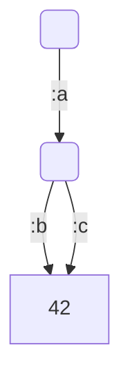
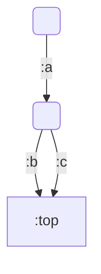
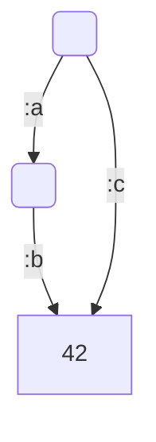

[](https://clojars.org/dag_unify)
[](https://opensource.org/licenses/EPL-1.0)
[](https://github.com/ekoontz/dag-unify/actions/workflows/clojure.yml)


# Introduction

A Clojure library for combining directed acyclic graphs
([DAGs](https://en.wikipedia.org/wiki/Directed_acyclic_graph)) via
[unification](https://en.wikipedia.org/wiki/Graph_theory#Subsumption_and_unification). Unification
is similar to Clojure core's
[merge](http://clojure.github.io/clojure/clojure.core-api.html#clojure.core/merge),
except that if arguments have the same keys, the arguments' values for
those keys will be recursively combined (as described below) to yield
the value for the key in the combined map.

# Usage

```
% git clone git@github.com:ekoontz/dag-unify.git
% cd dag-unify
% lein repl
nREPL server started on port 56364 on host 127.0.0.1 - nrepl://127.0.0.1:56364
REPL-y 0.3.7, nREPL 0.2.12
Clojure 1.8.0
Java HotSpot(TM) 64-Bit Server VM 1.8.0_121-b13
    Docs: (doc function-name-here)
          (find-doc "part-of-name-here")
  Source: (source function-name-here)
 Javadoc: (javadoc java-object-or-class-here)
    Exit: Control+D or (exit) or (quit)
 Results: Stored in vars *1, *2, *3, an exception in *e

user=> (require '[dag_unify.core :as dag])
nil
```

First, let's create a Clojure map that is also a directed acyclic
graph by using a Clojure atom within the map:

```
user=> (def foo (let [shared-value (atom 42)]
  #_=>            {:a {:b shared-value}
  #_=>                 :c shared-value}))
#'user/foo
```

A visualization of this graph:



You can use `dag/pprint` to print this map in a human-legible form:

```
user=> (dag/pprint foo)
{:a {:b [[1] 42]}, :c [1]}
```

In the above output, the `[1]` is used to represent the atom that is
the shared value of the two distinct paths `[:a :b]` and `[:c]`. If
there were other shared values, they would be represented by `[2]`,
`[3]`, ...

If you print this map `foo` in the default Clojure printer, it looks like:

```
user=> foo
{:a {:b #object[clojure.lang.Atom 0x6ee6ded {:status :ready, :val 42}]}, :c #object[clojure.lang.Atom 0x6ee6ded {:status :ready, :val 42}]}
```

In the above output, here again it can be seen, although perhaps a bit
less legibly, that the two atoms are identical because of their
identical hexadecimal identification numbers, and thus the same
in-memory object is being pointed-to by two different paths: `[:a :b]` and `[:c]`.

# Special keywords

There are two keywords, `:top` and `:fail`, that are treated
differently from other values.

## The special keyword `:top`

For this keyword `:top`, the following is true for all `X` (except for one exception):

```
(unify X :top) => X
```

The sole exception is when `X` is `:fail`, in which case:

```
(unify :fail :top) => :fail
```

Thus `:top` is the [identity
element](https://en.wikipedia.org/wiki/Identity_element) of
unification. It is the most unspecific, most general value
possible. It's useful when we want to represent the intention of "I
don't know what this thing is, but I want to have a placeholder that
might be filled in with something more specific later."

Another example of an identity element, from arithmetic is the number
1 the operation of multiplication: the result of multiplying any
number by 1 is that same number. Thus for unification, `:top` plays
the same role as 1 does in multiplication.

## Unification with non-`:top` values.

Suppose we have a map `bar`:

```
user=> (def bar (let [shared-value (atom :top)]
  #_=>            {:a {:b shared-value}
  #_=>                 :c shared-value}))
#'user/foo
```



Now, let's unify `bar` with another map: `{:c 42}` and print the result legibly:

```
user=> (dag/pprint (dag/unify bar {:c 42}))
{:c [[1] 42], :a {:b [1]}}
```

In graphical form:


Since `bar`'s value for `:c` is `:top`, the special identity element,
when we unify that with 42, the result is that there is an atom with
the the unified value, 42, which is, as it was with `bar`, shared as the
common value of both the path: `[:a :b]` and: `[:c]`.

## The special keyword `:fail`

The result of unifying any _a_ and _b_ is `:fail`, if:
- neither _a_ or _b_ are `:top`, and
- _a_ and _b_ are not maps (i.e. they are numbers, strings, keywords, sequences, etc.), and
- `(= a b) => false`

For example, `(unify 42 99) => :fail`, since 42 and 99 are not maps and 42 and 99 are not equal (`(= 42 99) => false`).

The result of unifying any _a_ and _b_ is also `:fail`, if:
- Either _a_ and _b_ are `:fail`.

Thus the result of unifying any value with `:fail` is itself `:fail`, just as
in arithmetic, the result of multiplying any number by 0 is itself 0.

Looking at our example map `bar` again, suppose we unify it again with
the same `{:c 42}`, but then unify it with yet another map: `{:c 99}`:

```
user=> (dag/pprint (-> bar
                       (dag/unify {:c 42})
                       (dag/unify {:c 99})))
:fail
```

Unification of these three input maps _failed_, because it could not unify
the two non-equal values 42 and 99.

The same would happen if we tried the other path, `[:a :b]`:

```
user=> (dag/pprint (-> bar
                       (dag/unify {:c 42})
                       (dag/unify {:a {:b 99}})))
:fail
```

Because the paths `[:a :b]` and `[:c]` share the same value in `foo`,
all results of unifications using it must also have that same path
shared within the result, but since `(= 42 99) => false`, unification fails.

## `clojure.core/get-in` vs. `dag_unify.core/get-in`


Considering the graph `baz`:

```
user=> (dag/pprint baz)
{:a {:b [[1] 42]}, :c [1]}
```

In graphical form:



Compare the output of `clojure.core/get-in` on `baz` using the path `[:a :b]`:

```
user=> (get-in baz [:a :b])
#object[clojure.lang.Atom 0x6ee6ded {:status :ready, :val 42}]
```

Versus the output of `dag_unify.core/get-in` with `baz` on the same path:

```
user=> (dag/get-in foo2 [:a :b])
42
```

Thus `dag_unify.core/get-in` resolves any atoms it finds as it
traverses within its input map and returns the value *within* the atom
rather than the atom itself. If that inner value is *itself* a ref,
then the resolving function will continue inward, resolving that ref
until it reaches a final non-ref value.

## Unification with atoms whose values are maps

If one of the arguments to `unify` is a map with a key whose value is
an atom, then the value of that key will still be that same atom, but its
value will be an atom whose value is the unification of the arguments. For example:

```
(let [shared-value (atom {:b 42})
      foo {:a shared-value}
      bar {:a {:c 43}}]
   (dag/unify foo bar))
=> {:a #<Atom@344dc027: {:c 43, :b 42}>}
```

Above, `foo`'s value for `:a` is a reference to the value `{:b
42}`. `foo`'s value for `:a` is unified with `bar`'s value for `:a`
(`{:c 43}`), and the result

```
{:b 42, c 43}
```

is the new value of the reference, and this reference is the value
`:a` for the unification of `foo` and `bar`.

In a graph where there is only a single path to an atom,
the atom will not be shown by `dag_unify.pprint` for legibility; thus, looking
at the same example immediately above, but with `dag_unify.pprint`:

```
(let [shared-value (atom {:b 42})
      foo {:a shared-value}
      bar {:a {:c 43}}]
   (dag/pprint (dag/unify foo bar)))
=> {:a {:c 43, :b 42}}
```

## `:fail` within maps

In any map, if any key's value is equal to `:fail`, the entire map is
equal to `:fail` from the point of view of unification. For example, the following map, despite its
complicated structure:

```
{:a 42
 :b {:c {:d :fail
         :e {:f 43}
             :g 44}}
 :h {:i "hello"}}
```

is no different from `:fail` as far as unification is concerned.

## `unify!` versus `unify`

`unify!` is destructive: it will modify its arguments if they contain
references, whereas `unify` copies its arguments before performing
unification, so that the input arguments are never modified.

# Applications

From [wikipedia](https://en.wikipedia.org/wiki/Graph_theory#Subsumption_and_unification):

> Well-known applications include automatic theorem proving and modeling
> the elaboration of linguistic structure.

[Menard](https://github.com/ekoontz/menard), a Clojure library for
parsing and generating natural language expressions, based on
[HPSG](https://en.wikipedia.org/wiki/Head-driven_phrase_structure_grammar),
is one example of such a linguistic application, and uses [dag_unify](https://github.com/ekoontz/dag_unify) to do this.

# License

Copyright © 2015 Eugene Koontz

Distributed under the Eclipse Public License either version 1.0 or (at
your option) any later version.

# References

- "Feature Structures & Unification" http://www.nltk.org/howto/featstruct.html
A similar library written in Python for the the Natural Language Toolkit (NLTK).

- https://en.wikipedia.org/wiki/Feature_structure

# See also:

- [CHANGELOG.md](CHANGELOG.md)
